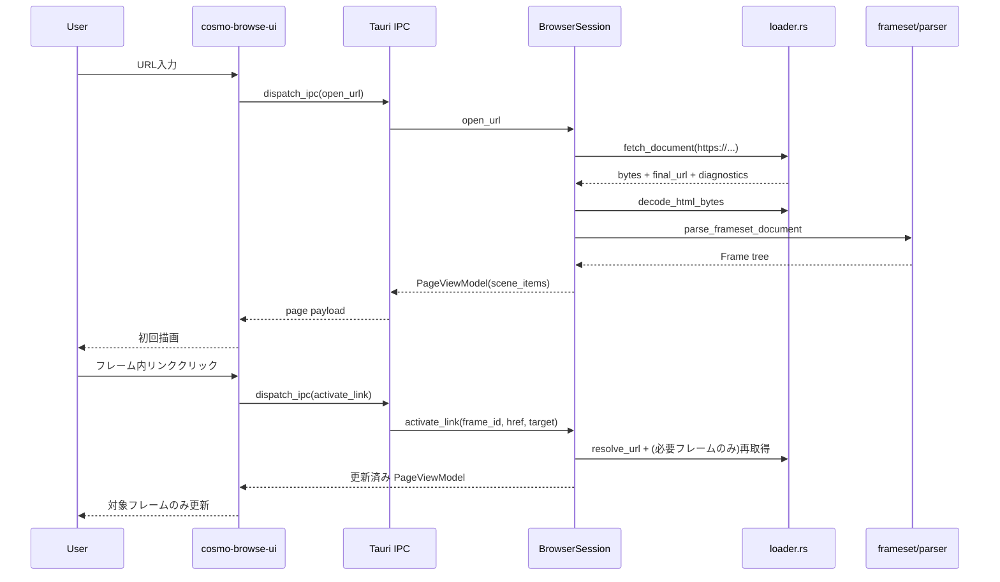

# Integrated Browser Sequence

URL 入力から HTTPS 取得、frameset 解析、描画、リンク遷移までの統合シーケンスです。

> Diagram source: `docs/architecture/mermaid/integrated-sequence.mmd`

```mermaid
sequenceDiagram
  participant User as User
  participant UI as cosmo-browse-ui
  participant IPC as Tauri IPC
  participant Session as BrowserSession
  participant Loader as loader.rs
  participant Parse as frameset/parser

  User->>UI: URL入力
  UI->>IPC: dispatch_ipc(open_url)
  IPC->>Session: open_url
  Session->>Loader: fetch_document(https://...)
  Loader-->>Session: bytes + final_url + diagnostics
  Session->>Loader: decode_html_bytes
  Session->>Parse: parse_frameset_document
  Parse-->>Session: Frame tree
  Session-->>IPC: PageViewModel(scene_items)
  IPC-->>UI: page payload
  UI-->>User: 初回描画

  User->>UI: フレーム内リンククリック
  UI->>IPC: dispatch_ipc(activate_link)
  IPC->>Session: activate_link(frame_id, href, target)
  Session->>Loader: resolve_url + (必要フレームのみ)再取得
  Session-->>UI: 更新済み PageViewModel
  UI-->>User: 対象フレームのみ更新
```
