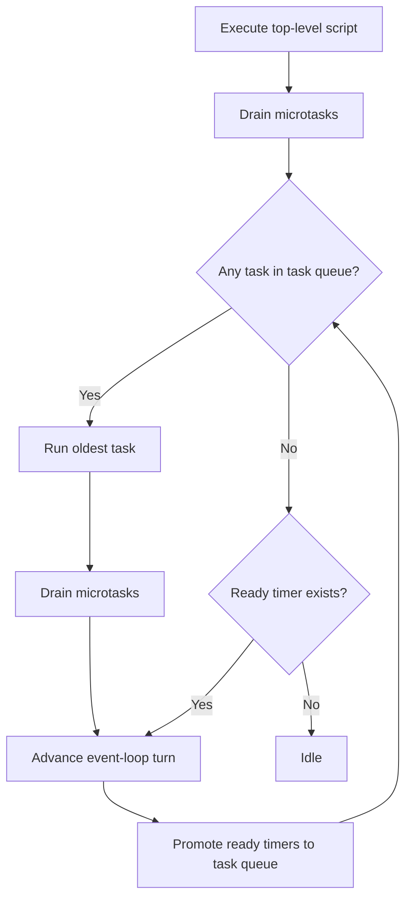

# JS Event Loop (minimum runtime)

`CosmoBrowse` の最小 JS ランタイムは HTML Standard の event loop を「実装可能な最小集合」に絞って運用する。

## 実装準拠ルール

1. **Top-level script は 1 task として実行し、終了直後に microtask checkpoint を必ず行う。**
2. **task queue は FIFO で 1 件ずつ実行し、各 task 後に microtask queue を空になるまで drain する。**
3. **`setTimeout(callback, delay)` は timer queue に登録し、次の event-loop turn で macrotask(task queue) に昇格させる。**
4. **`queueMicrotask(callback)` と `Promise.then(callback)` は microtask queue へ callback を追加する。**
5. **task が無い turn でも、期限到達 timer が存在する場合は timer を task queue に移し、1 task 実行する。**
6. **`DOMContentLoaded` はパース完了後に dispatch し、登録済み listener を task queue へ積む。**
7. **`dispatch_click`/`dispatch_input`/`dispatch_change` は DOM Standard の event dispatch を簡略化し、対象要素に登録済み listener を task queue へ積む。**
8. **DOM 変更（例: `textContent` 更新）が発生した場合は、`DOM更新 -> レイアウト再計算 -> 再描画` をトリガする。**
9. **飢餓・ハング対策として、event loop / microtask drain の反復上限を超えた場合は警告ログを記録し処理を打ち切る。**

> Diagram source: `docs/architecture/mermaid/js-event-loop.mmd`

## タスクキュー仕様（切替タイミング）

- **microtask 優先**
  - 各 macrotask 実行後は、次の macrotask を取り出す前に microtask queue を空になるまで実行する。
  - Top-level script 完了時点でも同様に microtask checkpoint を行う。
- **macrotask 切替タイミング**
  - microtask queue が空になった時点でのみ次の macrotask へ切り替える。
  - `setTimeout` で登録した timer は「次の turn 以降」に task queue へ移動し、同一 turn の microtask より後で実行される。
- **安全ガード**
  - `MAX_EVENT_LOOP_ITERATIONS` を超える連続 turn を検知した場合は `possible hang/starvation` 警告を記録する。
  - `MAX_MICROTASK_DRAIN_ITERATIONS` を超える microtask 連鎖を検知した場合は `possible infinite Promise/microtask chain` 警告を記録し、drain を打ち切る。

## ハング検知メトリクスの `AppMetricsSnapshot` 反映方針（検討）

- 現時点では `JsRuntime` 内でハング/飢餓警告を `warning_logs` として保持する。
- `AppMetricsSnapshot` へは次段階で次の 2 指標を連携する設計とする。
  - `event_loop_hang_warning_count`: セッション中に guard が発火した回数
  - `last_event_loop_hang_warning`: 直近の警告メッセージ
- 先行してスキーマを変更すると IPC/UI 互換性に影響するため、本変更ではランタイム実装と仕様文書を優先し、メトリクス配線は follow-up とする。

## Supported minimum set

- Event dispatch
  - `document.addEventListener("DOMContentLoaded", handler)`
  - `element.onclick = handler`
  - `element.oninput = handler`
  - `element.onchange = handler`
  - `element.addEventListener("click"|"input"|"change", handler)`
  - runtime API: `dispatch_click(target_id)` / `dispatch_input(target_id)` / `dispatch_change(target_id)`
- Timer task
  - `setTimeout(callback, delay)`
- Microtasks / jobs
  - `queueMicrotask(callback)`
  - `Promise.then(callback)` (最小互換)
- DOM read/write
  - `document.getElementById(id)`
  - `element.textContent`

## Unsupported API error policy

未対応 API は次の統一形式で diagnostics に記録する。

- `Unsupported browser API: <api_name>`

## Spec references

- HTML LS: event loop processing model / microtask checkpoint / update the rendering / DOMContentLoaded timing
  - https://html.spec.whatwg.org/multipage/webappapis.html#event-loop-processing-model
  - https://html.spec.whatwg.org/multipage/webappapis.html#perform-a-microtask-checkpoint
  - https://html.spec.whatwg.org/multipage/webappapis.html#update-the-rendering
  - https://html.spec.whatwg.org/multipage/parsing.html#the-end
- HTML LS: timers
  - https://html.spec.whatwg.org/multipage/timers-and-user-prompts.html#timers
- DOM Standard: event dispatch / event listener
  - https://dom.spec.whatwg.org/#concept-event-dispatch
  - https://dom.spec.whatwg.org/#concept-event-listener
- ECMAScript: jobs and job queues / execution contexts
  - https://262.ecma-international.org/#sec-jobs-and-job-queues
  - https://262.ecma-international.org/#sec-execution-contexts
