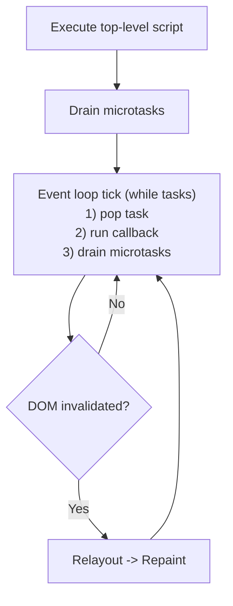

# JS Event Loop (minimum runtime)

`CosmoBrowse` の最小 JS ランタイムは HTML Standard の event loop を「実装可能な最小集合」に絞って運用する。

## 実装準拠ルール

1. **Top-level script は 1 task として実行し、終了直後に microtask checkpoint を必ず行う。**
2. **task queue は FIFO で 1 件ずつ実行し、各 task 後に microtask queue を空になるまで drain する。**
3. **`setTimeout(callback, delay)` は task queue へ callback を追加する（`delay` は現状無視）。**
4. **`queueMicrotask(callback)` と `Promise.then(callback)` は microtask queue へ callback を追加する。**
5. **`DOMContentLoaded` はパース完了後に dispatch し、登録済み listener を task queue へ積む。**
6. **`dispatch_click`/`dispatch_input`/`dispatch_change` は DOM Standard の event dispatch を簡略化し、対象要素に登録済み listener を task queue へ積む。**
7. **DOM 変更（例: `textContent` 更新）が発生した場合は、`DOM更新 -> レイアウト再計算 -> 再描画` をトリガする。**

> Diagram source: `docs/architecture/mermaid/js-event-loop.mmd`

## Supported minimum set

- Event dispatch
  - `document.addEventListener("DOMContentLoaded", handler)`
  - `element.onclick = handler`
  - `element.oninput = handler`
  - `element.onchange = handler`
  - `element.addEventListener("click"|"input"|"change", handler)`
  - runtime API: `dispatch_click(target_id)` / `dispatch_input(target_id)` / `dispatch_change(target_id)`
- Timer task
  - `setTimeout(callback, delay)`
- Microtasks / jobs
  - `queueMicrotask(callback)`
  - `Promise.then(callback)` (最小互換)
- DOM read/write
  - `document.getElementById(id)`
  - `element.textContent`

## Unsupported API error policy

未対応 API は次の統一形式で diagnostics に記録する。

- `Unsupported browser API: <api_name>`

## Spec references

- HTML LS: event loop processing model / microtask checkpoint / update the rendering / DOMContentLoaded timing
  - https://html.spec.whatwg.org/multipage/webappapis.html#event-loop-processing-model
  - https://html.spec.whatwg.org/multipage/webappapis.html#perform-a-microtask-checkpoint
  - https://html.spec.whatwg.org/multipage/webappapis.html#update-the-rendering
  - https://html.spec.whatwg.org/multipage/parsing.html#the-end
- HTML LS: timers
  - https://html.spec.whatwg.org/multipage/timers-and-user-prompts.html#timers
- DOM Standard: event dispatch / event listener
  - https://dom.spec.whatwg.org/#concept-event-dispatch
  - https://dom.spec.whatwg.org/#concept-event-listener
- ECMAScript: jobs and job queues / execution contexts
  - https://262.ecma-international.org/#sec-jobs-and-job-queues
  - https://262.ecma-international.org/#sec-execution-contexts
