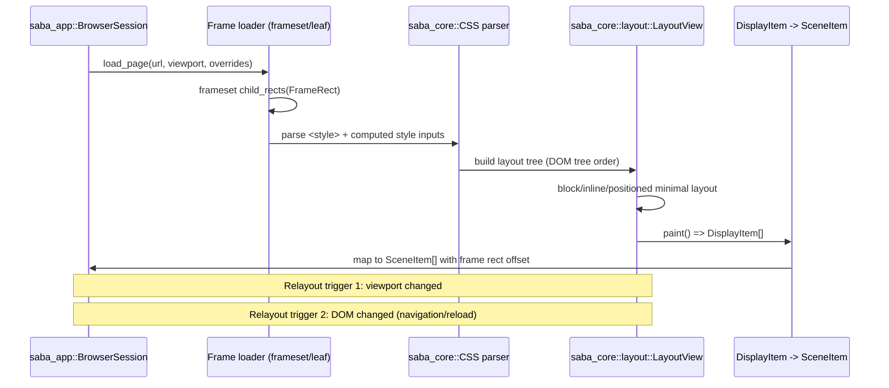
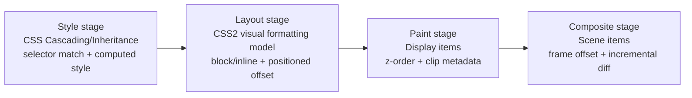

# Layout flow

CosmoBrowse の最小レイアウトパイプライン（style → layout → paint）と、frameset 矩形への接続点。

- Frameset 文書では `FrameRect` で子フレーム領域を分割し、leaf 文書で style/layout/paint/composite を実行する。
- leaf 文書の `SceneItem` 座標は `FrameRect` の `(x, y)` を加算してページ座標へ変換する。
