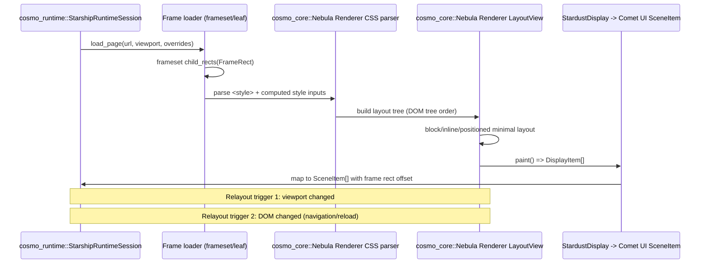
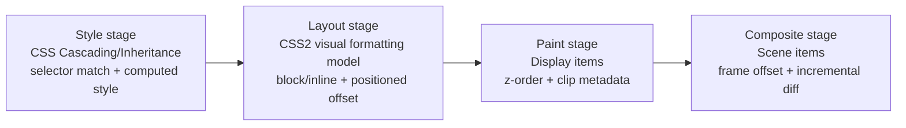

# Layout flow

CosmoBrowse の最小レイアウトパイプライン（style → layout → paint）と、frameset 矩形への接続点。

- Frameset 文書では `FrameRect` で子フレーム領域を分割し、leaf 文書で style/layout/paint/composite を実行する。
- leaf 文書の `SceneItem` 座標は `FrameRect` の `(x, y)` を加算してページ座標へ変換する。

## Layout calculation entrypoint and minimal normal-flow spec

- 入口: `LayoutView::new` → `update_layout` → `calculate_node_size` / `calculate_node_position`。
- `calculate_node_size` は「子を先に計算し、親を再計算する」2-passで block/inline を解決する。
- 最小仕様:
  - **Block formatting context**: block は縦に積む（前兄弟 block または自身 block で改行）
  - **Inline flow**: inline/text は同一行で横方向に連結
  - すべての box は `content + padding + border` を border-box として保持し、`margin` は外側オフセットとして配置にのみ使う
