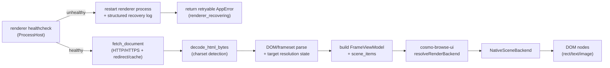
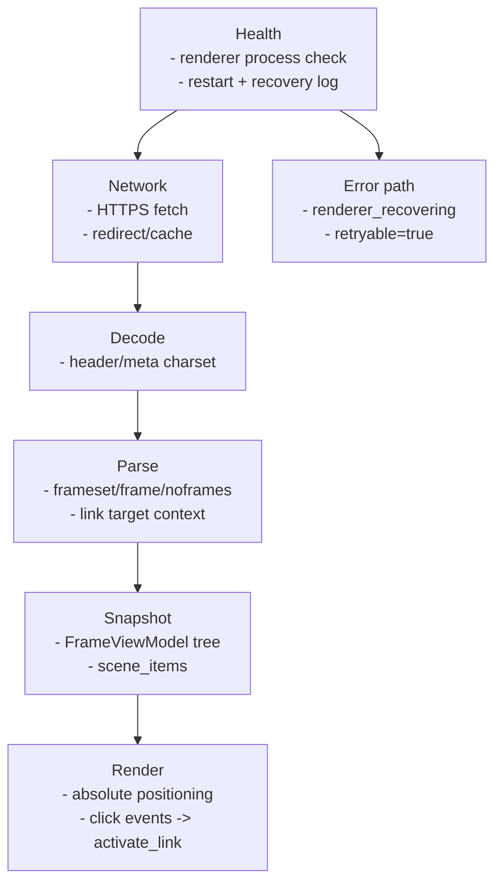

# Render Pipeline

## Current Pipeline (Native Scene + Recovery Path)

> Diagram source: `docs/architecture/mermaid/render-pipeline.mmd`

## Stage responsibilities

## Notes
- `adapter_native` は `dispatch` 前に healthcheck を行い、Renderer 異常終了時は自動再起動を試みます。
- 自動再起動後の同一リクエストは失敗として返し、`retryable=true` の `AppError` を UI に返却します。
- 復旧イベントは JSON 構造化ログ（`renderer_recovered` / `renderer_recovery_failed`）で記録します。
- `render_backend = web_view` が来ても UI 側は Native Scene にフォールバックします。
