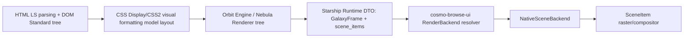
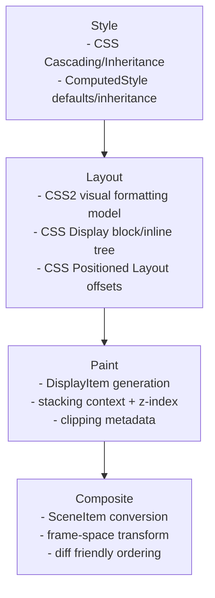
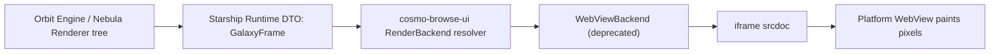

# Render Pipeline

## Current (SceneItem native pipeline)

> Diagram source: `docs/architecture/mermaid/render-pipeline.mmd`

## Stage responsibilities

## Legacy (deprecated WebView compatibility path)

## Backend swap points

- `FrameViewModel.render_backend` is the backend selection hint transported from `cosmo_runtime`.
- `resolveRenderBackend(frame)` in `main.ts` is the single switch point for backend replacement.
- `RenderBackend.renderLeafFrame(...)` now resolves to scene item rendering only; WebView is deprecated.

## Current implementation status

- `NativeSceneBackend`: renders `scene_items` directly into positioned DOM nodes (`rect`, `text`, `image`) without `iframe srcdoc`.
- `WebViewBackend`: deprecated and no longer used for leaf-frame rendering in the UI pipeline.
- The effective runtime rendering path is scene-only, aligned with engine-produced paint order.
