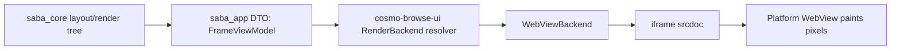
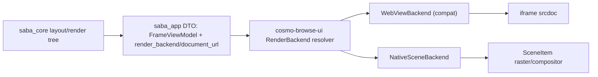

# Render Pipeline

## Current (`WebViewBackend`)

## Target (`RenderBackend` abstraction)

## Backend swap points

- `FrameViewModel.render_backend` is the backend selection hint transported from `saba_app`.
- `resolveRenderBackend(frame)` in `main.ts` is the single switch point for backend replacement.
- `RenderBackend.renderLeafFrame(...)` isolates leaf-frame rendering so `WebViewBackend` and future native backends can coexist.

## Current implementation status

- `WebViewBackend`: keeps compatibility path via `iframe srcdoc`.
- `NativeSceneBackend`: now renders `scene_items` directly into positioned DOM nodes (`rect`, `text`, `image`) without `iframe srcdoc`.
- The `frame.render_backend` field now selects between both implementations at runtime.
