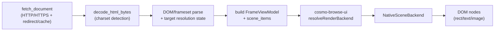
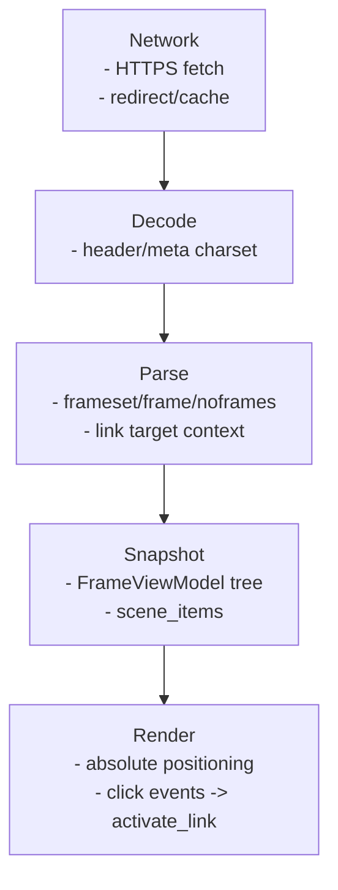

# Render Pipeline

## Current Pipeline (Native Scene)

> Diagram source: `docs/architecture/mermaid/render-pipeline.mmd`

## Stage responsibilities

## Notes
- 現在の既定経路は Native Scene です。
- `render_backend = web_view` が来ても UI 側は Native Scene にフォールバックします。
