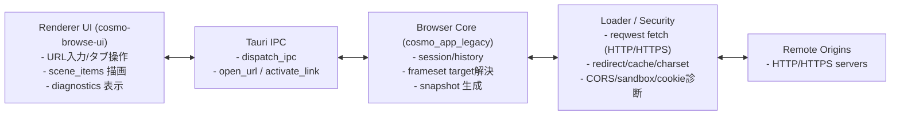

# Runtime topology

CosmoBrowse は Browser Core（Rust）と Renderer UI（Tauri/WebView 上の TS）の 2 層で動作します。

> Diagram source: `docs/architecture/mermaid/runtime-topology.mmd`

## Boundary rules
- UI は DTO（`PageViewModel`, `FrameViewModel`）のみを受け取り、ローダー実装には依存しません。
- HTTPS 通信、文字コード判定、フレームターゲット解決は Rust 側で完結します。
- UI は `scene_items` を描画し、クリックイベントを IPC 経由で Core に戻します。
