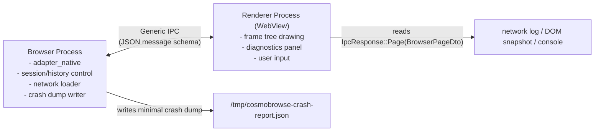

# Runtime topology

CosmoBrowse fixes the Browser/Renderer boundary with the following two-process model.

> Diagram source: `docs/architecture/mermaid/runtime-topology.mmd`

## Boundary rules
- Browser/Renderer communication uses framework-neutral schema (`IpcRequest`/`IpcResponse`).
- The Renderer depends only on DTOs (`BrowserPageDto`, `NavigationState`, `TabSummary` etc.) and never on `saba_app` internal structures.
- `dispatch_ipc` is the default command entrypoint, while per-command Tauri handlers are compatibility mode.
- On crash, the panic hook emits a minimal JSON dump and reproduction steps.
