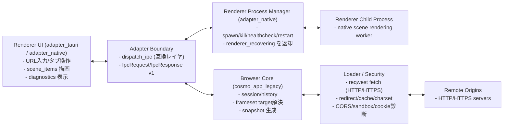

# Runtime topology

CosmoBrowse は Browser Core（Rust）と Renderer UI の 2 層を基本にしつつ、`adapter_native` では Renderer 子プロセス監視を含む 3 層（UI / Adapter Boundary / Process Manager）で動作します。
現状は Tauri/WebView 互換経路も維持し、目標は Rust ネイティブ描画（WebView 非依存）です。

> Diagram source: `docs/architecture/mermaid/runtime-topology.mmd`

## Boundary rules
- UI は DTO（`PageViewModel`, `FrameViewModel`）のみを受け取り、ローダー実装には依存しません。
- `dispatch_ipc` 実行時に adapter 側で Renderer プロセスのヘルスチェックを行い、復旧中は retryable な `AppError` を返します。
- HTTPS 通信、文字コード判定、フレームターゲット解決は Rust 側で完結します。
- UI は `scene_items` を描画し、クリックイベントを adapter 境界経由で Core に戻します。

## Migration notes (WebView 非依存化)
- `adapter_tauri` は移行期間の互換実装として維持し、標準経路を `adapter_native` へ段階移行します。
- 互換性のため `dispatch_ipc` 契約は維持し、フロントの呼び出し面を先に安定化します。
- 最終的には WebView ランタイム必須要件を外し、Rust ネイティブ描画を既定にします。
