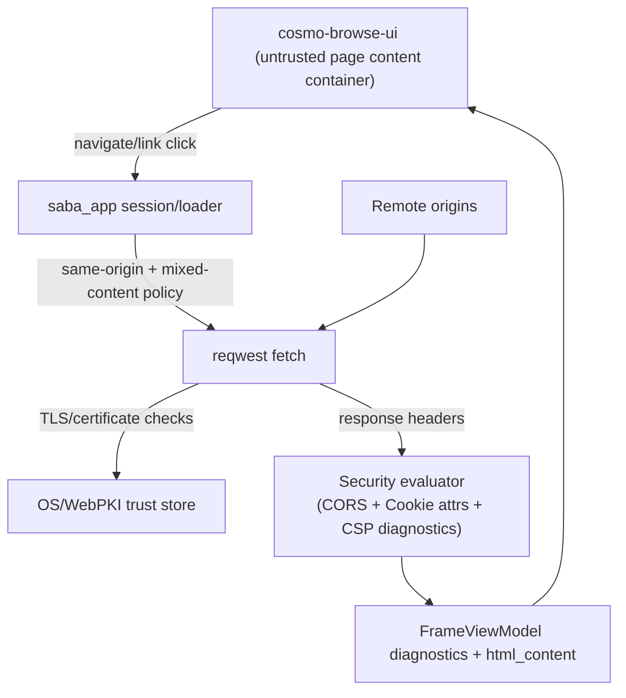

# Security Boundary

CosmoBrowse applies a unified security boundary in `saba_app` so navigation, frame loading, and resource admission share the same origin/certificate/CSP baseline.

## Trust boundary diagram

## Boundary policy summary

- Same-origin comparison is centralized and used by frame navigation and resource read decisions.
- Cross-origin response access is reported through Fetch-style CORS checks (`Access-Control-Allow-Origin`).
- Cookie attribute checks evaluate `Secure`, `HttpOnly`, and `SameSite` combinations and emit diagnostics.
- Mixed content is blocked for `https -> http` hops.
- Certificate/TLS failures are normalized into a single policy-facing error message class.
- A minimum CSP baseline is injected when absent (`default-src 'self'; object-src 'none'; base-uri 'self'`) and inline-script diagnostics are emitted.

## Spec anchors

- RFC 6454 (Origin): same-origin tuple and serialization.
- Fetch CORS protocol: `Access-Control-Allow-Origin` processing.
- RFC6265bis cookie attributes: `Secure`, `HttpOnly`, `SameSite`.
- CSP Level 3: baseline source list policy and violation reporting.
