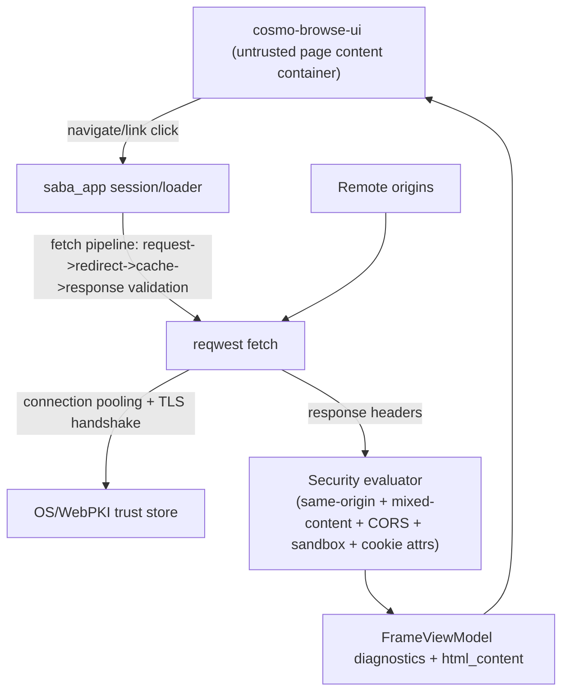

# Security Boundary

CosmoBrowse applies a unified security boundary in `saba_app` so navigation, frame loading, and resource admission share the same origin/certificate/CSP baseline.

## Trust boundary diagram

## Boundary policy summary

- Same-origin comparison is centralized and used by frame navigation/resource admission decisions.
- Mixed content is blocked for `https -> http` hops before the frame is considered runnable.
- Cross-origin response access is reported through Fetch-style CORS checks (`Access-Control-Allow-Origin`).
- Sandbox evaluation marks cross-origin loads as restricted (script/top-navigation privileges are treated as withheld unless explicitly allowed by policy).
- Cookie attribute checks evaluate `Secure`, `HttpOnly`, and `SameSite` combinations and emit diagnostics.
- A minimum CSP baseline is injected when absent (`default-src 'self'; object-src 'none'; base-uri 'self'`) and inline-script diagnostics are emitted.

## Network boundary and permission constraints

- **Network transport boundary:** all remote IO is performed by `reqwest::blocking::Client` with TLS verification delegated to Rustls/WebPKI and the host trust store.
- **Connection reuse:** a shared process-level client is reused so HTTP/TLS sessions can be pooled per host; per-request clients are not created in the hot path.
- **Cache boundary:** only in-memory HTML documents are cached; cache keys are request/final URL strings and validators are limited to `ETag` + `Cache-Control` handling.
- **Privilege boundary:** fetched content remains untrusted input; policy checks gate diagnostics and embed/runtime constraints rather than granting direct native capabilities.

## Failure fault model

- **Redirect failures:** redirect loops and malformed/missing `Location` headers become deterministic network errors.
- **Validation failures:** mixed content and same-origin/sandbox violations are policy outcomes with explicit diagnostics.
- **TLS failures:** certificate/handshake failures are normalized into a `tls_error` class.
- **Cache coherence failures:** if a conditional request returns `304 Not Modified` without a resident cache entry, the pipeline treats it as a cache miss and continues with network fetch semantics.
- **Response parse failures:** invalid header lines/status lines become parse/network errors; the caller receives a structured `AppError` instead of partially trusted content.

## Spec anchors

- RFC 9110 (HTTP Semantics): method/target semantics, status line, redirect behavior.
- RFC 9111 (HTTP Caching): `Cache-Control`, validators (`ETag`, `If-None-Match`), freshness.
- RFC 6454 (Origin): same-origin tuple and serialization.
- Fetch CORS protocol: `Access-Control-Allow-Origin` processing.
- RFC6265bis cookie attributes: `Secure`, `HttpOnly`, `SameSite`.
- TLS 1.3 (RFC 8446): secure transport and certificate validation expectations.
- WHATWG URL Standard/RFC 3986 reference resolution: URL parsing and redirect target joining.
- CSP Level 3 + HTML sandbox model: baseline source-list policy and restricted cross-origin embed behavior.
